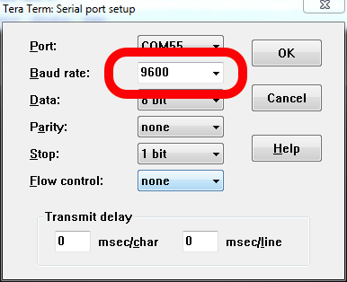

# IoT DevFest 2019

Welcome to our session at IoT DevFest 2019! If you have any questions, please just give a shout. We are here to help.

In this session you'll be building five examples, introducing you to:

1. Building IoT devices with [Arm Mbed OS](https://os.mbed.com/).
1. Hooking up a temperature sensor to a development board.
1. Connecting your device to [The Things Network](https://www.thethingsnetwork.org/) using LoRaWAN.
1. Data visualization of temperature sensors.

In case you're stuck this document will help you get back on track. If you're a fast learner, there are 'extra credit'-assignments at the end of each section. Please help your neighbours as well :-)

## Prerequisites

1. Create an Arm Mbed online account [here](https://os.mbed.com/account/signup/).
1. Then install the following software for your operating system below.

**Windows**

If you are on Windows, install:

1. [ST Link](http://janjongboom.com/downloads/st-link.zip) - serial driver for the board.
    * Run `dpinst_amd64` on 64-bits Windows, `dpinst_x86` on 32-bits Windows.
    * Afterwards, unplug your board and plug it back in.
    * (Not sure if it configured correctly? Look in 'Device Manager > Ports (COM & LPT)', should list as STLink Virtual COM Port.
1. [Tera term](https://osdn.net/projects/ttssh2/downloads/66361/teraterm-4.92.exe/) - to see debug messages from the board.

1. [Node.js](https://nodejs.org/en/download/) - to show visualizations.

**Linux**

If you're on Linux, install:

1. screen - e.g. via `sudo apt install screen`
1. [Node.js](https://nodejs.org/en/download/) - to show visualizations.

**MacOS**

If you're on MacOS, install:

1. [Node.js](https://nodejs.org/en/download/) - to show visualizations.

### Grab some hardware

* Grab a NUCLEO-F411RE development board.
* Grab a SX1272 LoRa shield.
* Grab a temperature sensor.

Plug the LoRa shield on top of the F411RE, and connect the temperature sensor to pin A1/A2 on the shield.

## 1. Some simple applications in the simulator

There is an Mbed simulator which you can use to test things out quickly. Let's build some small examples:

1. Go to [the simulator](https://labs.mbed.com/simulator/).
1. Load `Blinky`.

This blinks the LED every 500 ms. We can make it dependend on an input signal as well. For example, place the following code in the editor and click *Compile*.

```
#include "mbed.h"

DigitalOut led(LED1);
DigitalIn btn(BUTTON1);

int main() {
    while (1) {
        led = btn.read() ? 1 : 0;
        printf("Blink! LED is now %d\r\n", led.read());

        wait_ms(500);
    }
}
```

This turns the LED on when you press the on-board button. However this is inefficient as the microcontroller needs to keep checking the state of the button. We can also an 'interrupt' to detect this instead.

```cpp
#include "mbed.h"

DigitalOut led(LED1);
InterruptIn btn(BUTTON1);

void fall() {
    led = !led;
}

int main() {
    btn.fall(&fall);
}
```

Now the MCU can go to sleep automatically in between actions. A downside of this is that your `fall` function now runs in an ISR, and some things are not safe in an ISR such as calling `printf` (because it's guarded by Mutex'es). This is not an issue in the simulator, but it will be on the board. We can use an EventQueue to prevent this and automatically debounce the interrupt event:

```cpp
#include "mbed.h"
#include "mbed_events.h"

EventQueue queue;

DigitalOut led(LED1);
InterruptIn btn(BUTTON1);

void fall() {
    led = !led;
    printf("LED is now %d\r\n", led.read());
}

int main() {
    btn.fall(queue.event(&fall));

    queue.dispatch_forever();
}
```

Let's use some components:

1. Click *Add component*.
1. Select 'Red LED', and pin `p5` - Click *Add component*.
1. Click *Add component* again.
1. Select 'Analog Thermistor* and pin `p15` - Click *Add component*.

Now place the following code:

```cpp
#include "mbed.h"
#include "mbed_events.h"

AnalogIn temp(p15);
DigitalOut led(p5);
Serial pc(USBTX, USBRX, 115200);

EventQueue queue;

void check_temperature() {
    const int B = 4275;               // B value of the thermistor
    const int R0 = 100000;            // R0 = 100k

    float R = 1.0f/temp.read() - 1.0f;
    R = R0*R;

    float temperature = 1.0/(log(R/R0)/B+1/298.15)-273.15; // convert to temperature via datasheet
    printf("Temperature: %0.2f\r\n", temperature);

    led = temperature > 20.0f ? 1 : 0;
}

int main() {
    queue.call_every(1000, &check_temperature);

    queue.dispatch_forever();
}
```

Click *Run* and observe what you see.

## 2. Running it on the real board

Now let's run it on an actual board.

1. Go to [https://os.mbed.com](https://os.mbed.com) and sign up (or sign in).
1. Go to the [NUCLEO-F411RE](https://os.mbed.com/platforms/ST-Nucleo-F411RE/) platform page and click *Add to your Mbed compiler*.
1. Import the example program into the Arm Mbed Compiler by clicking [this link](https://os.mbed.com/compiler/#import:/teams/mbed-os-examples/code/mbed-os-example-blinky/).
1. Click *Import*.
1. In the top right corner make sure you selected 'NUCLEO-F411RE'.

This has cloned blinky.

1. Open `main.cpp` and replace with:

    ```
    #include "mbed.h"

    DigitalOut led(LED1);
    Serial pc(USBTX, USBRX, 115200);

    int main() {
        while (1) {
            led = !led;
            printf("Blink! LED is now %d\r\n", led.read());

            wait_ms(100);
        }
    }
    ```

1. Click *Compile*.
1. A binary (.bin) file downloads, use drag-and-drop to drag the file to the NODE_F411RE device (like a USB mass storage device).

    **Note:** Here's a [video](https://youtu.be/L5TcmFFD0iw?t=1m25s).

1. When flashing is complete, hit the *BLACK* button (under the shield).

You should see the LED blink very fast.

Look at the examples you ran in the simulator, you can run them on the board too; just replace the code in `main.cpp`. Also:

1. Replace `p5` with `LED1` (or hook up an LED to your board).
1. Replace `p15` with `A1` (because we hooked this up to a different pin on the physical board).

## 3. Showing logs

#### Windows

To see debug messages, install:

1. [Arm Mbed Windows serial driver](http://os.mbed.com/media/downloads/drivers/mbedWinSerial_16466.exe) - serial driver for the board.
    * See above for more instructions.
    * No need to install this if you're on Windows 10.
1. [Tera term](https://osdn.net/projects/ttssh2/downloads/66361/teraterm-4.92.exe/) - to see debug messages from the board.

When you open Tera Term:

1. Select *Serial*, and then select the Mbed COM port.

    

1. Click **Setup > Serial Port**.
1. Select baud rate **115200**.

    

#### macOS

No need to install a driver. Open a terminal and find out the handler for your device:

```
$ ls /dev/tty.usbm*
/dev/tty.usbmodem14603
```

Then connect to the board using screen:

```
screen /dev/tty.usbmodem14603 115200
```

To exit, press: `CTRL+A` then `CTRL+\` then press `y`.

#### Linux

If it's not installed, install GNU screen (`sudo apt-get install screen`). Then open a terminal and find out the handler for your device:

```
$ ls /dev/ttyACM*
/dev/ttyACM0
```

Then connect to the board using screen:

```
sudo screen /dev/ttyACM0 9600                # might not need sudo if set up lsusb rules properly
```

To exit, press `CTRL+A` then type `:quit`.

## 4. Statistics and RTOS (bonus)

**Are you far ahead? Then go through this part! If not, just skip over it!**

Mbed OS is an advanced Real-Time operating system that can spawn multiple threads and handle execution switching between them automatically. In addition it can automatically handle putting the MCU to sleep (or deep sleep). Let's look at how this works.

1. In `main.cpp`, put;

    ```cpp
    #include "mbed.h"
    #include "mbed_events.h"
    #include "mbed_stats.h"

    DigitalOut led(LED1);
    Serial pc(USBTX, USBRX, 115200);

    void print_stats() {
        // allocate enough room for every thread's stack statistics
        int cnt = osThreadGetCount();
        mbed_stats_stack_t *stats = (mbed_stats_stack_t*) malloc(cnt * sizeof(mbed_stats_stack_t));

        cnt = mbed_stats_stack_get_each(stats, cnt);
        for (int i = 0; i < cnt; i++) {
            printf("Thread: 0x%lX, Stack size: %lu / %lu\r\n", stats[i].thread_id, stats[i].max_size, stats[i].reserved_size);
        }
        free(stats);

        // Grab the heap statistics
        mbed_stats_heap_t heap_stats;
        mbed_stats_heap_get(&heap_stats);
        printf("Heap size: %lu / %lu bytes\r\n", heap_stats.current_size, heap_stats.reserved_size);

        mbed_stats_cpu_t cpu_stats;
        mbed_stats_cpu_get(&cpu_stats);

        printf("CPU: uptime=%lld, idle=%lld\r\n", cpu_stats.uptime, cpu_stats.idle_time);
        printf("Sleep: sleep=%lld, deepsleep=%lld\r\n", cpu_stats.sleep_time, cpu_stats.deep_sleep_time);
        printf("\r\n");
    }

    int main() {
        while (1) {
            print_stats();

            led = !led;

            Thread::wait(1000);
        }
    }
    ```

1. Flash this application on the board. What do you see?

Note: The board does not enter deepsleep (only normal sleep) because tickless mode is not enabled. You can enable tickless mode by adding a `"macros": ["MBED_TICKLESS=1"]` section to your `mbed_app.json` file.

### Adding an extra thread

You can run the stats tracking code in a separate thread. Replace the `int main()` function with:

```cpp
void new_thread_main() {
    while (1) {
        print_stats();

        Thread::wait(2000);
    }
}

int main() {
    Thread new_thread;
    new_thread.start(&new_thread_main);

    while (1) {
        led = !led;

        Thread::wait(1000);
    }
}
```

Flash this on the board and compare with the previous output. What do you see? Do you see the new thread?

**Assignment:** we use only a fraction of the stack of the new thread, but have allocated 4096 bytes for it. Make the stack size of the new thread smaller. [Here's the documentation](https://os.mbed.com/docs/v5.8/reference/thread.html).


## 4b. Getting data from the thermistor

Look at the simulator code for interacting with the thermistor. Change the application so that it reads data from the real sensor.

Note that the thermistor is hooked up to `A1`, not `p15`.

## 5. Importing the IoT DevFest project

Alright, let's connect your board to The Things Network. Let's grab the IoT DevFest repository.

1. Open the Online Compiler.
1. Click *Import > Import from URL*.
1. Enter `https://github.com/janjongboom/iot-devfest`
1. Click *Import*.
1. In the top right corner make sure you selected 'NUCLEO-F411RE'.

    

## 6. Getting credentials for the The Things Network

We need to program some keys in the device. LoRaWAN uses an end-to-end encryption scheme that uses two session keys. The network server holds one key, and the application server holds the other. (In this tutorial, TTN fulfils both roles). These session keys are created when the device joins the network. For the initial authentication with the network, the application needs its device EUI, the EUI of the application it wants to join (referred to as the application EUI) and a preshared key (the application key).

Let's register this device in The Things Network and grab some keys!

### Connecting to The Things Network

#### Setting up

1. Go to [The Things Network Console](https://console.thethingsnetwork.org)
2. Login with your account or click [Create an account](https://account.thethingsnetwork.org/register)

   

   >The Console allows you to manage Applications and Gateways.

3. Click **Applications**
4. Click **Add application**
5. Enter a **Application ID** and **Description**, this can be anything
6. Be sure to select `ttn-handler-us-west` in **Handler registration**

   

   >The Things Network is a global and distributed network. Selecting the Handler that is closest to you and your gateways allows for higher response times.

7. Click **Add application**

   

   >LoRaWAN devices send binary data to minimize the payload size. This reduces channel utilization and power consumption. Applications, however, like to work with JSON objects or even XML. In order to decode binary payload to an object, The Things Network supports [CayenneLPP](https://www.thethingsnetwork.org/docs/devices/arduino/api/cayennelpp.html) and Payload Functions: JavaScript lambda functions to encode and decode binary payload and JSON objects. In this example, we use CayenneLPP.

8. Go to **Payload Format** and select **CayenneLPP**

   

#### Registering your Device

1. In your application, go to **Devices**
1. Click **register device**
1. Enter a name.
1. Click the *Generate automatically* button.

    

   >You can leave the Application EUI to be generated automatically.

5. Click **Register**

   

   >Your device needs to be programmed with the **Device EUI**, **Application EUI** and **App Key**

7. Click the `< >` button of the **Device EUI**, **Application EUI** and **App Key** values to show the value as C-style array
8. Click the **Copy** button on the right of the value to copy to clipboard

   


#### Pasting them in the Online Compiler

In the Online Compiler now open `main.cpp`, and paste the Device EUI, Application EUI and Application Key in.


**Note:** Do not forget the `;` after pasting.

**Tip:** You can run this code in the simulator too. Select 'LoRaWAN', click *Load*, paste the code in, and click *Run*.

#### Compiling

Go back to the Online Compiler and click *Compile* and flash the application to your board again. You should see the physical board sending data from the temperature sensor.


## 7. Relaying data back to the device (bonus)

**Skip over this if you're behind!**

We only *send* messages to the network. But you can also relay data back to the device. Note that LoRaWAN devices can only receive messages when a RX window is open. This RX window opens right after a transmission, so you can only relay data back to the device right after sending.

To send some data to the device:

1. Open the device page in the TTN console.
1. Under 'Downlink', enter some data under 'Payload', select port 15, select 'Confirmed' and click *Send*.
1. Inspect the logs on the device to see the device receive the message.

If you have an external LED you can control it from the network. You **cannot** use LED1 on the F411RE because it interferes with the radio shield.

## 8. Getting data out of The Things Network

To get some data out of The Things Network you can use their API. Today we'll use the node.js API, but there are many more.

First, you need the application ID, and the application key.

1. Open the TTN console and go to your application.
1. Your application ID is noted on the top, write it down.

    

1. Your application Key is at the bottom of the page. Click the 'show' icon to make it visible and note it down.

    

With these keys we can write a Node.js application that can retrieve data from TTN.

1. Open a terminal or command prompt.
1. Create a new folder:

    ```
    $ mkdir lora-workshop-api
    $ cd lora-workshop-api
    ```

1. In this folder run:

    ```
    $ npm install ttn blessed blessed-contrib
    ```

1. Create a new file `server.js` in this folder, and add the following content (replace YOUR_APP_ID and YOUR_ACCESS_KEY with the respective values from the TTN console):

    ```js
    let TTN_APP_ID = 'YOUR_APP_ID';
    let TTN_ACCESS_KEY = 'YOUR_ACCESS_KEY';

    const ttn = require('ttn');

    TTN_APP_ID = process.env['TTN_APP_ID'] || TTN_APP_ID;
    TTN_ACCESS_KEY = process.env['TTN_ACCESS_KEY'] || TTN_ACCESS_KEY;

    ttn.data(TTN_APP_ID, TTN_ACCESS_KEY).then(client => {
        client.on('uplink', (devId, payload) => {
            console.log('retrieved uplink message', devId, payload);
        });

        console.log('Connected to The Things Network data channel');
    }).catch(err => {
        console.error('Failed to connect to The Things Network', err);
    });
    ```

1. Now run:

    ```
    $ node server.js
    ```

The application authenticates with the The Things Network and receives any message from your device.

## 9. More fancy maps?


Follow the instructions at https://github.com/janjongboom/ttn-sensor-maps/ to set it up!


**Add coverage**

The Things Network is a collaborative network. You can extend the network yourself by placing a gateway, or you can use existing coverage from community members. See [The Things Network Map](https://www.thethingsnetwork.org/map) to see if there is coverage in your area or region.

Setting up a gateway is easy and becomes more and more affordable. Here are two recommended options:

1. The highly configurable [MultiTech Conduit](https://www.digikey.com/en/product-highlight/m/multi-tech-systems/iot-platform); you need an `MTAC-LORA-915` or `MTAC-LORA-868` depending [on your country](https://www.thethingsnetwork.org/docs/lorawan/frequencies-by-country.html), as well as a `MTCDT` Conduit;
1. The Things Network's own product, [The Things Gateway 915 MHz](http://www.newark.com/productimages/standard/en_US/05AC1807-40.jpg) or [The Things Gateway 868 MHz](http://uk.farnell.com/the-things-network/ttn-gw-868/the-things-gateway-eu/dp/2675813)
